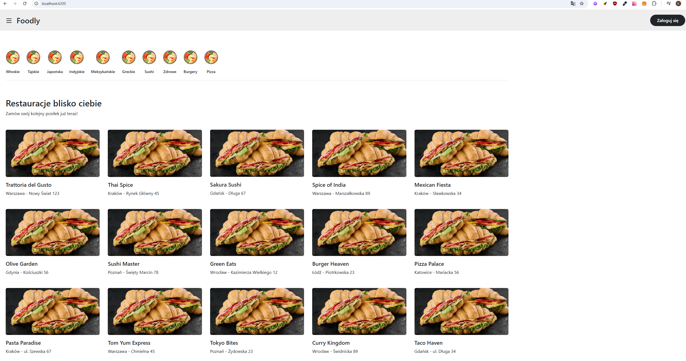
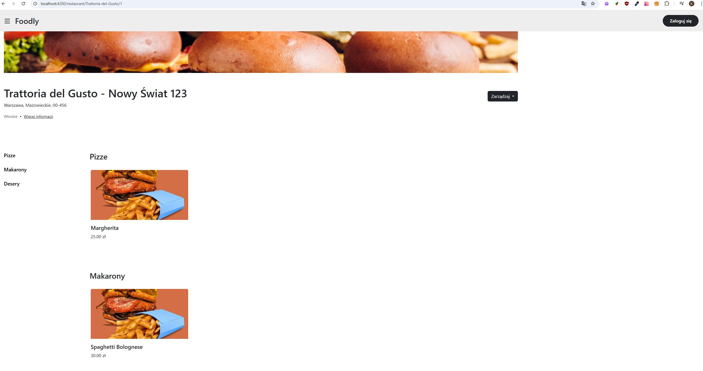
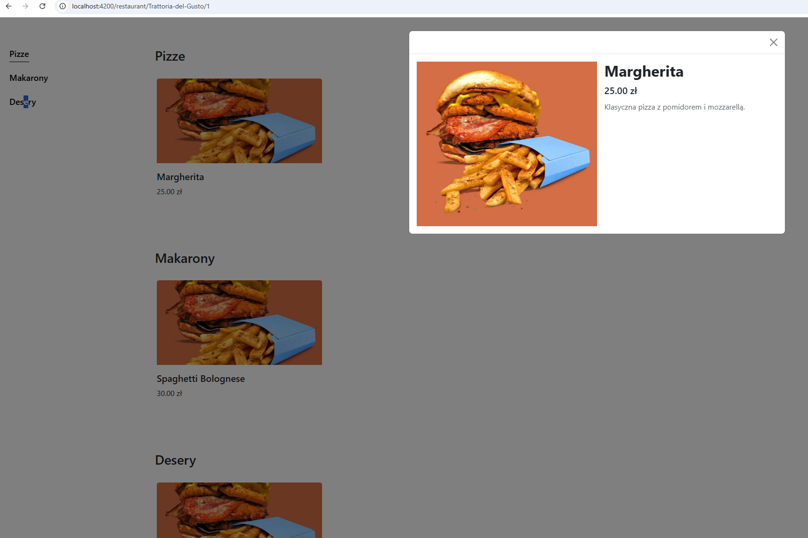
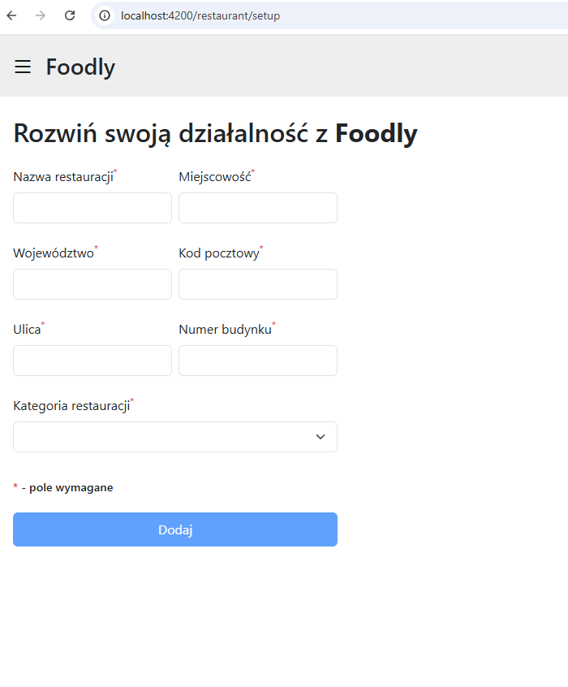
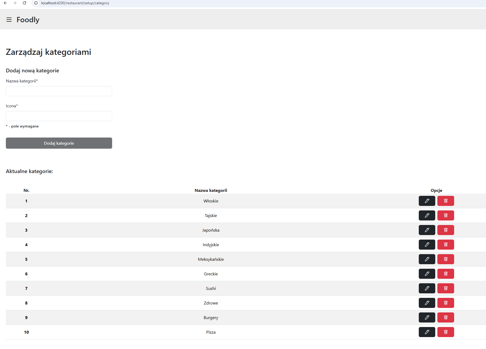
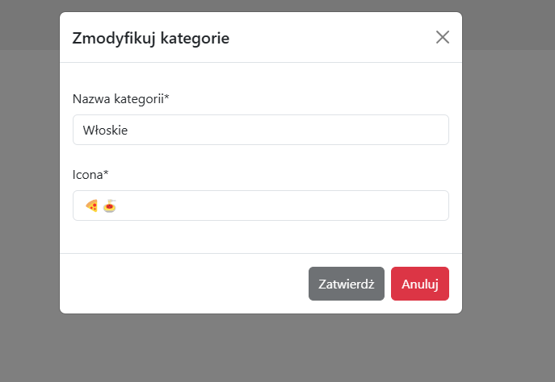
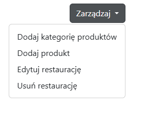
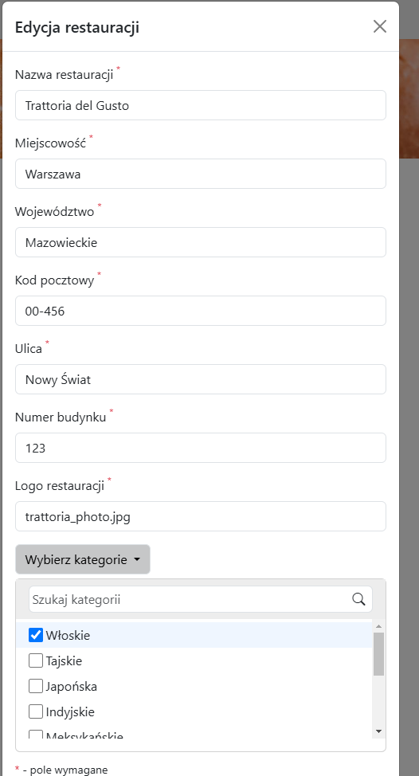

# Foodly

Foodly to aplikacja internetowa stworzona w celu nauki oraz praktycznego wykorzystania nowoczesnych technologii frontendowych i backendowych, takich jak Angular oraz Spring Boot. Projekt został zaprojektowany tak, aby implementować podstawowe funkcjonalności, w tym operacje CRUD.

---

## Cel projektu

Głównym celem projektu jest poszerzenie wiedzy z zakresu tworzenia aplikacji webowych poprzez praktyczne wykorzystanie Angulara do budowy frontendu oraz Spring Boota jako backendowego frameworka. Projekt ma na celu zrozumienie procesów integracji między frontendem a backendem, zarządzania bazą danych, a także wprowadzenie do narzędzi takich jak Flyway czy Hibernate.

---

## Technologie

### Frontend

- **Angular 15**: Framework do tworzenia dynamicznych aplikacji webowych, wykorzystujący TypeScript.
- **Bootstrap**: Framework CSS do szybkiego budowania responsywnych interfejsów użytkownika.

### Backend

- **Spring Boot 2.7**: Framework do budowy aplikacji backendowych w Javie, umożliwiający szybkie tworzenie REST API.
- **Flyway**: Narzędzie do zarządzania migracjami bazy danych.
- **Lombok**: Biblioteka do redukcji kodu w Javie poprzez automatyczne generowanie getterów, setterów i innych konstrukcji.
- **Hibernate**: Framework ORM (Object-Relational Mapping) do zarządzania bazą danych w Javie.

### Baza danych

- **PostgreSQL**: Relacyjna baza danych, używana do przechowywania danych aplikacji.

## Struktura Backend

Backend aplikacji Foodly został zaprojektowany w sposób modularny, co umożliwia łatwe zarządzanie kodem oraz jego dalszy rozwój. Każdy moduł odpowiada za inną domenę biznesową aplikacji, taką jak użytkownicy, restauracje czy produkty. Struktura opiera się na zasadach architektury wielowarstwowej, co zapewnia czytelność i separację logiki biznesowej od dostępu do danych oraz obsługi żądań HTTP.

### Główne moduły backendu:

- **Product**: Odpowiada za zarządzanie produktami (np. dania w restauracjach) i ich kategoriami.
- **Restaurant**: Zarządza informacjami o restauracjach, w tym ich szczegółami, lokalizacjami i powiązanymi danymi.
- **User**: Moduł obsługujący użytkowników aplikacji, w tym ich rejestrację, logowanie oraz zarządzanie rolami.

### Kluczowe warstwy w każdym module:

- **Application**: Zawiera logikę biznesową i serwisy odpowiadające za operacje na danych oraz interakcje między warstwami.
- **Web**: Obsługuje żądania HTTP za pomocą kontrolerów REST API.
- **Domain**: Reprezentuje encje (modele danych) i repozytoria do interakcji z bazą danych.

Całość jest zintegrowana z bazą danych PostgreSQL, a zarządzanie migracjami schematów realizowane jest za pomocą Flyway. Dzięki wykorzystaniu Hibernate jako ORM, operacje na danych są uproszczone i zgodne z dobrymi praktykami.

## Struktura Frontend

Frontend aplikacji Foodly został stworzony z wykorzystaniem frameworka Angular 15, z naciskiem na wykorzystanie nowoczesnych funkcjonalności tego frameworka, takich jak moduły, komponenty, routingi i serwisy. Projekt ma modularną strukturę, co ułatwia rozwój i utrzymanie kodu.

### Główne moduły frontendu:

1. **Main**:

   - Główna strona aplikacji, która wyświetla przegląd dostępnych restauracji.
   - Odpowiada za routingi do innych części aplikacji.

2. **Product**:

   - Moduł zarządzający wyświetlaniem produktów i ich szczegółów.
   - Komponent `product-preview` obsługuje podgląd produktów, a `product-setup` służy do ich konfiguracji (do zaimplementowania w przyszłości).

3. **Restaurant**:

   - Moduł zawierający szczegóły restauracji, ich menu oraz podział na kategorie (np. pizze, makarony).
   - Kluczowe komponenty:
     - `restaurant-page`: Strona szczegółów restauracji.
     - `restaurant-details`: Szczegóły restauracji, takie jak adres i dane kontaktowe.
     - `restaurant-setup`: Moduł administracyjny dla konfiguracji restauracji (do rozwinięcia).

4. **Shared**:
   - Moduł wspólny, zawierający elementy wykorzystywane w wielu miejscach aplikacji, takie jak:
     - **Model**: Definicje interfejsów danych (np. `Product`, `Restaurant`).
     - **UI**: Wspólne elementy interfejsu użytkownika, takie jak przyciski, modale.
     - **Utils**: Funkcje pomocnicze, które mogą być używane w całym projekcie.

### Użycie technologii

- **Bootstrap**: Framework CSS został użyty do szybkiego prototypowania i zapewnienia responsywnego wyglądu. W przyszłych wersjach planowane jest przejście na bardziej estetyczne rozwiązania z użyciem własnych stylów.
- **Routingi**: Każdy moduł ma oddzielny plik routingu, co pozwala na łatwe zarządzanie nawigacją między stronami, takimi jak główna strona, szczegóły restauracji czy podgląd produktów.
- **Serwisy**: Każdy moduł zawiera dedykowane serwisy do obsługi logiki biznesowej i komunikacji z API backendowym.

### Wygląd aplikacji

- Aplikacja wykorzystuje siatkę Bootstrap do prezentacji elementów w formie responsywnych kart.
- Przykładowe widoki to:

### Wygląd aplikacji (przykłady)

1. **Strona główna**:
   Na stronie głównej użytkownik widzi listę restauracji w postaci siatki:
   

2. **Strona szczegółów restauracji**:
   Szczegóły restauracji, takie jak menu oraz lokalizacja:
   

3. **Podgląd produktu w modalnym oknie**:
   Szczegóły dania w modalnym oknie:
   
4. **Pozostałe funkcjonalności**:

